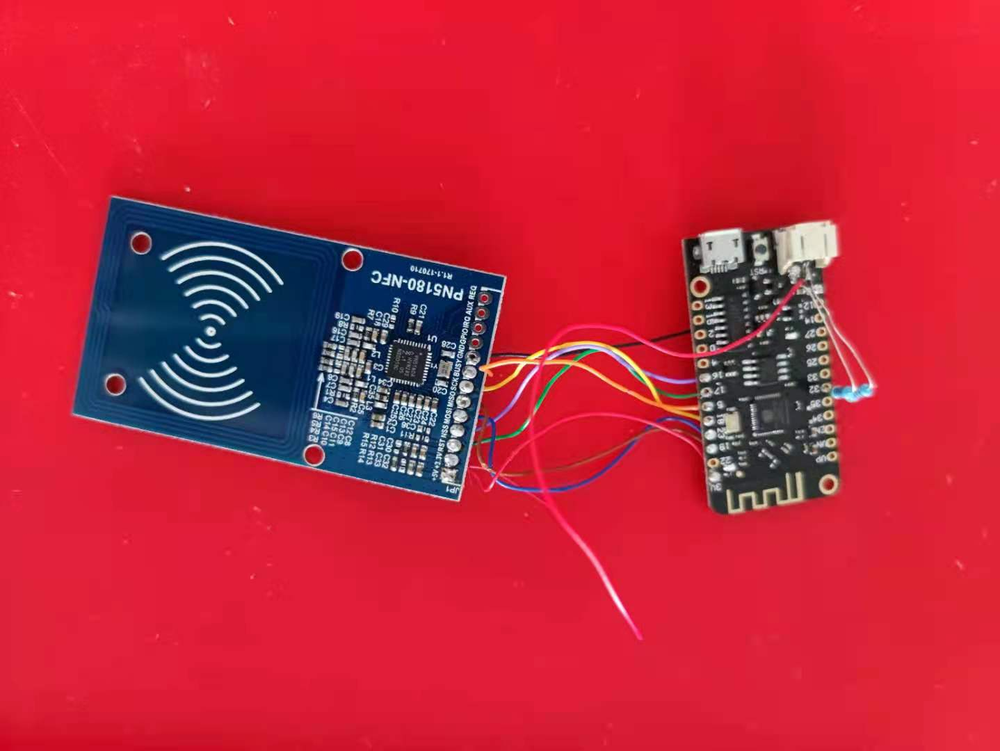
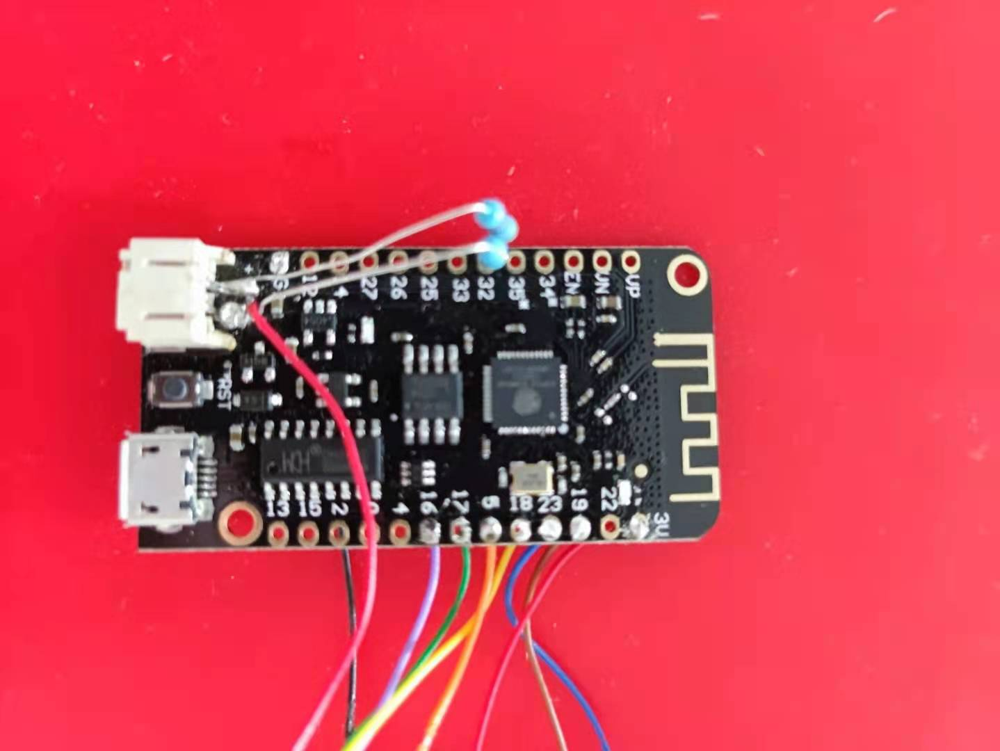
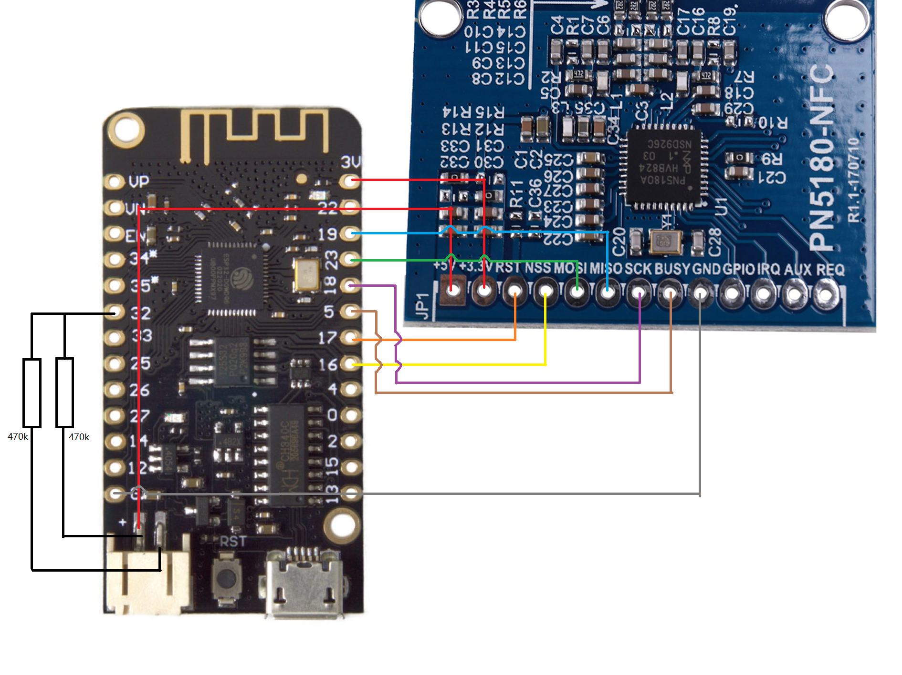

# LiRey
> LiRey stands for Libre Reader, inspired by [LimiTTer](https://github.com/JoernL/LimiTTer) and [xDrip+](https://github.com/NightscoutFoundation/xDrip)

## 0x00 背景 Background
雅培瞬感在中囯发售的一代没有蓝牙功能，想要组成实时血糖监控，需要购买蓝牙接收器，或自己制作。  
商业蓝牙接收器有喵喵，其已经出了两代，但价格高昂。开源的有LimiTTer，但其使用的BM019模块，淘宝上实在找不到。  
于是本项目应运而生。 本项目改为使用较为易得的PN5180模块。其已有现成的[Library](https://github.com/ATrappmann/PN5180-Library)。

## 0x01 设计 Design
项目使用LOLIN32 lite模块作为微处理器，PN5180模块作为nfc收发模块，通过SPI接口连接。  
LOLIN32 lite可以使用3.7v锂电为其供电。喵喵也有上报电池电量的功能。但电池电压高于esp32的3.3v的端口工作电压。在模块GPIO32号端口，加装了两个470kΩ电阻组成分压电路，将电池分压一半作为读数，电池最高4.2v，一般为2.1v，低于3.3v的工作电压。电流不到40μA。  
PN5180需要5v供能，光3.3v驱动不了nfc发射，本项目直接由电池供电，因电池电压可以达到4v以上，让pn5180稍稍欠压工作，不引入更多电路，先简单的将系统运行起来。




## 0x02 接线 Wiring
| ESP-32 |  方向   | PN5180 |
| ------ | ------ | ------ |
|  VBAT  | <----> |   5v   |
|  3.3V  | <----> |  3.3V  |
|  GND   | <----> |   GND  |
|SCLK, 18| -----> |  SCLK  |
|MISO, 19| <----- |  MISO  |
|MOSI, 23| <----- |  MOSI  |
| SS, 16 | -----> |   NSS  |
|BUSY, 5 | <----- |  BUSY  |
|Reset, 17| -----> |  RST  |

在GPIO32端口连接两个470KΩ，一个连到电池正极VBAT，一个连到负极GND.



## 0x03 协议 Protocol
协议是通过分析xDrip+项目找到的，使用简单的喵喵协议。

- 蓝牙
    - 蓝牙名字以”miaomiao“开头
    - UUID
        |  |  |
        | ---- | ---- |
        | nRF服务 |6E400001-B5A3-F393-E0A9-E50E24DCCA9E |
        | TX特性 | 6E400003-B5A3-F393-E0A9-E50E24DCCA9E |
        | RX特性 | 6E400002-B5A3-F393-E0A9-E50E24DCCA9E |

- 下发指令
    - 开启新传感器  0xD3 0x01
    - 设置上报周期  0xD1 0x分钟数
    - 立即读取     0xF0

- 上报指令
    - 没有找到传感器，发送单个字节 0x34
    - 传感器未启动，发送单个字节 0x32

- 喵喵上报数据包
    由头部、libre数据和patchinfo组成
    - 头部
        - 长度为18个字节 TOMATO_HEADER_LENGTH = 18
        - 第0个字节为 0x28 
        - 第1，2字节为消息长度 expectedSize = 256 * (int)(buffer[1] & 0xFF) + (int)(buffer[2] & 0xFF)
        - 第3，4字节 未找到
        - 5到13字节为 传感器序列号 PatchUid
        - 第13字节为 喵喵电量
        - 第14，15字节为 喵喵固件版本 TomatoFirmware
        - 第16，17字节为 喵喵硬件版本 TomatoHArdware
    - libre数据只取前 344 字节
    - PatchInfo
        - 第0，1，2字节为传感器类型
        ``` java
        case 0xdf0000: return SensorType.Libre1;
        case 0xa20800: return SensorType.Libre1New;
        case 0xe50003: return SensorType.LibreUS14Day;
        case 0x9d0830: return SensorType.Libre2;
        case 0x700010: return SensorType.LibreProH;
        ```
        - 读取patchInfo命令 0x02, 0xa1, 0x07
        - 首字节为 0x00 需丢弃
        ``` java
        cmd = new byte[] {0x02, (byte)0xa1, 0x07}
        patchInfo = nfcvTag.transceive(cmd);
        if(patchInfo != null) {
            // We need to throw away the first byte.
            patchInfo = Arrays.copyOfRange(patchInfo, 1, patchInfo.length);
        }
        ```
    - 血糖值读数
        - 读取命令为 0x02, 0x23, 0xi, 0x02 (i为块号)
        - 美国的libre1需要addressed读取
        - 首字节丢弃

## 0x04 计划 Planing
在软件方面希望能直接解析瞬感数据，并能通过wifi直接上传NightScout。  
硬件方面首先希望加个升压电路，升到5v给pn5180供电。欠压工作，电流可能升高，可能对器件不好。之后希望设计一体板，缩小天线尺寸。

## 0x05 感谢 Acknowledgement
感谢@JoernL的LimiTTer项目，给本项目极大的启发。  
感谢XDrip+项目，提供了瞬感和喵喵的协议。  
感谢@ATrappmann的PN5180-Library，为pn5180提供了驱动。  
感谢亥步推出的喵喵，感谢雅培推出瞬感系列，极大方便糖友们监测自己的血糖。
